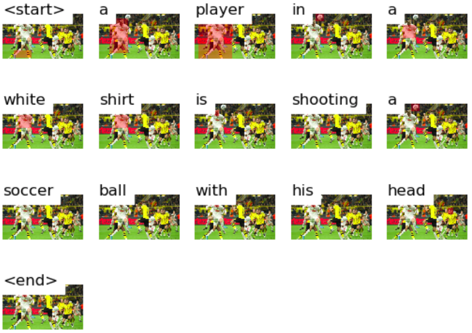

# Image captioning using region attention
This is a code in Pytorch used for a project with Abdellah Kaissari in the course Object Recognition and Computer Vision (MVA Class 2019/2020).
The project is about image captioning using region attention and focuses on the paper Bottom-Up and Top-Down Attention for Image Captioning and Visual Question Answering.




## Getting Started


### Requirements

Python 3.6 

Pytorch 0.4 

CUDA 9.0 

and a GPU of course...


### Installing

1. Clone the code: 

```
git clone https://github.com/ayouboumani/image-captioning-with-attention.git
```

2.Create the environment for the Bottom-Up part:

```
conda create --name bottom_env
conda activate bottom_env
```
Next, go to the directory 'bottom-up' and run this command for installing python packages:

```
pip install -r requirements.txt
```
```
conda deactivate
```
3.Create the environment for the Top-Down part:

```
conda create --name top_env
conda activate top_env
```
Next, go to the directory 'top-down' and run:

```
pip install -r requirements.txt
```
```
conda deactivate
```

## Running the code

### 0. Pre-trained models 

1. Bottom-Up: download from https://drive.google.com/file/d/10MBUgH_OygyEys59FNQ4qNGeQ9bl-ODb/view?usp=drivesdk
and put it in bottom-up/models/. 
This model is trained on Visual Genome.
2. Top-Down: download from https://drive.google.com/file/d/10atC8rY7PdhnKW08INO33mEXYUyQ6G0N/view
and put it in top-down/.
This model is trained on Microsoft COCO dataset.

### 1. Demo

In your working directory, create the folders: images/, features/ and captions/.
Put your test images in the corresponding folder.
1. Extract image features. First, activate the bottom env, go to the bottom-up directory and run either:
```
python extract_features.py --image_dir ../images --out_dir ../features --boxes
```
or if you don't want to view attention :(  :
```
python extract_features.py --image_dir ../images --out_dir ../features 
```
2. Then activate the top env, go to the top-down directory.
Open the script attention_demo.py and change the following directories:
images_dir = '../images'
features_dir = '../features'
data_folder = './'  
data_name = 'coco_5_cap_per_img_5_min_word_freq'  # base name shared by data files
checkpoint_file = 'BEST_34checkpoint_coco_5_cap_per_img_5_min_word_freq.pth.tar'  
word_map_file = 'WORDMAP_coco_5_cap_per_img_5_min_word_freq.json'

If all is well, then simply run:
```
python attention_demo.py 
```
You will find the captions with attention regions in the caption folder :) .

### 2. Data preparation

To train the model on your own dataset say Flicker8k. First generate features as shown in the previous section. Then open the create_input_files.py and cahnge the arguments as you desire. If you want to use an existing wordmap to encode the captions, change the word_map argument else remove it.
Run the script create_input_files.py in the top-down environment.

### 3. Training

To train your model using cross-entropy loss and teacher forcing run:
```
python train.py 
```
If you want to test self-critical sequence training then run:

```
python reinforce.py 
```
The training with reinforce.py is not optimized and needs improvements using curriculum learning. However, it works fine with simple and easy captions. 

### 4. Evaluation


```
python eval.py 
```

## Acknowledgments
This code is mainly a combination of existing repositories:
* https://github.com/poojahira/image-captioning-bottom-up-top-down
* https://github.com/violetteshev/bottom-up-features
* https://github.com/sgrvinod/a-PyTorch-Tutorial-to-Image-Captioning

